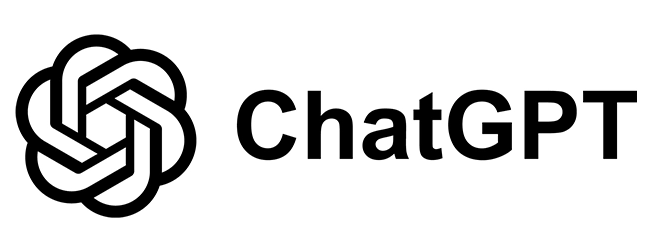
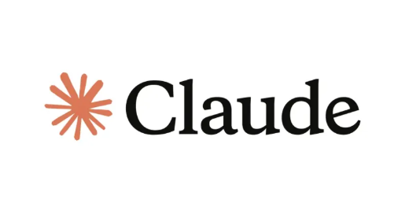

# I. Introduction

Something about AI

# II. Personal Experience with AI

## 1. Experience WODs (e.g. E18)

paragraph

## 2. In-class Practice WODs

paragraph

## 3. In-class WODs

paragraph

## 4. Essays

paragraph

## 5. Final Project

paragraph

## 6. Learning a Concept / Tutorial

paragraph

## 7. Answering a Question in Class or in Discord

paragraph

## 8. Asking or Answering a Smart Question

paragraph

## 9. Coding Example (e.g. “give an example of using Underscore .pluck”)

paragraph

## 10. Explaining Code

paragraph

## 11. Writing Code

paragraph

## 12. Documenting Code

paragraph

## 13. Quality Assurance (e.g. fixing ESLint errors)

paragraph

## 14. Other Uses in ICS 314 Not Listed

paragraph

# III. Impact on Learning and Understanding

paragraph

# IV. Practical Applications

paragrapj

# V. Challenges and Opportunities

paragraph

# VI. Comparative Analysis

paragrapj

# VII. Future Considerations

paragrapj

# VIII. Conclusion

paragraph
