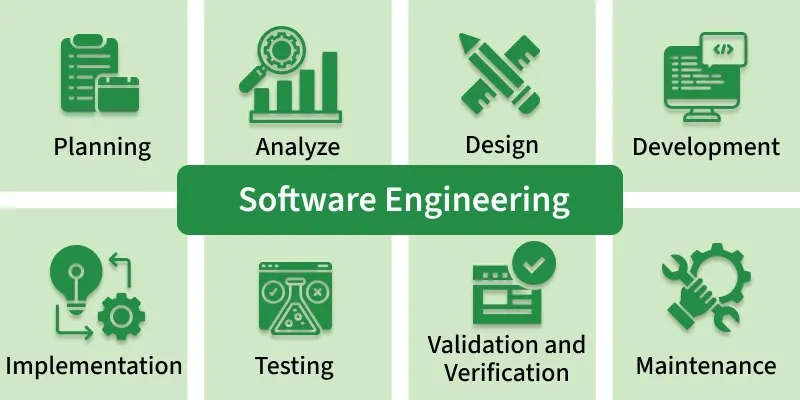

## Software Engineering at its Core

At face value, software engineering is simply writing code to carry out functions. However, learning software engineering in my ICS 314 class at the University of Hawaii at Manoa, I've come to realize that software engineering is a much deeper and complex subject. At its core, software engineering is dynamic and constantly changing how it works in the world. At first, software engineers prioritized memory efficiency and created impossible to read code in order to take less space. However, as memory got cheaper and more software engineers began appearing, cooperation and coding standards became the new standard. Even so, recently, software engineers have started drifting towards AI.

## Coding Standards

Speaking of cooperation and coding standards, these were two topics that I learned much about within my ICS314 class. One of the first assignments was regarding ES Lint, an application that upheld a coding standard. From then on, every coding assignment would be expected to follow those standards. This was completely unlike before, in which I could write however I wanted as long as the code ran. This standardized coding practice led into cooperation and team work. The final for my ICS 314 class was a group project. By introducing coding standards early on, I was able to cooperate and code with 3 other class mates and produce a high quality website.

## Design Patterns

Prior to the final project, our professor introduced us to design patterns. The core concept of design patterns is dealing with a common issue through a reusable solution that someone else came up with. This was prominently used within my final project. For example, the component pattern was utilized throughout the website to make an easily navigable website with card, navbar, form, etc. Additionally, I used the Model View Controller (MVC) pattern to separate the website into a model, viewer, and controller. This allowed for issues to stay contained within their domains as the model dealt with the database, the viewer dealt with the user display and the controller acted as a medium from the viewer to the model. I plan on using design patterns whenever possible for all my future coding projects after seeing first hand how efficient it is.

## Ethics in Software Engineering

As stated in the introduction, most people only see software engineering and typing up code at a computer. Something most people, including myself, fail to notice is the complicated ethics behind software engineering. While it may seem as simple as writing code that your boss tells you to, what if that application is malicious? In the current world, privacy is a massive concern as every day it seems that companies are getting exposed for selling user data to make millions. Each coder behind the stolen data had to have thought whether it was worth it or not, and decided that it was worth it. ICS 314 drove me further to this moral conundrum as it introduces the ACM code of ethics. Overall, the code tells software engineers that it is ethical to do a good job and always make sure that no one is hurt. It delves into hurt people being individuals such as those being targeted for a justified purpose as well as an unaware general populace that is being taken advantage of. In my Fall 2026 semester I plan on taking ICS 390 at the same college. This course is all about ethics with current events being analyzed as well as ethics in the form of teaching newer students.

## Conclusion

In total, software engineering is a vast subject that is deeper than just typed words on a keyboard. Software engineering is a cooperative field that has been around long enough for stable standards and solutions to have been created that may help newcomers. In addition, software engineering is directly tethered to ethics in the form of code use and helping others to our fullest potential. As software engineers it is imperative to be curious and open to new ideas in this constantly evolving subject.
