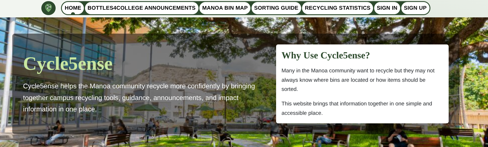
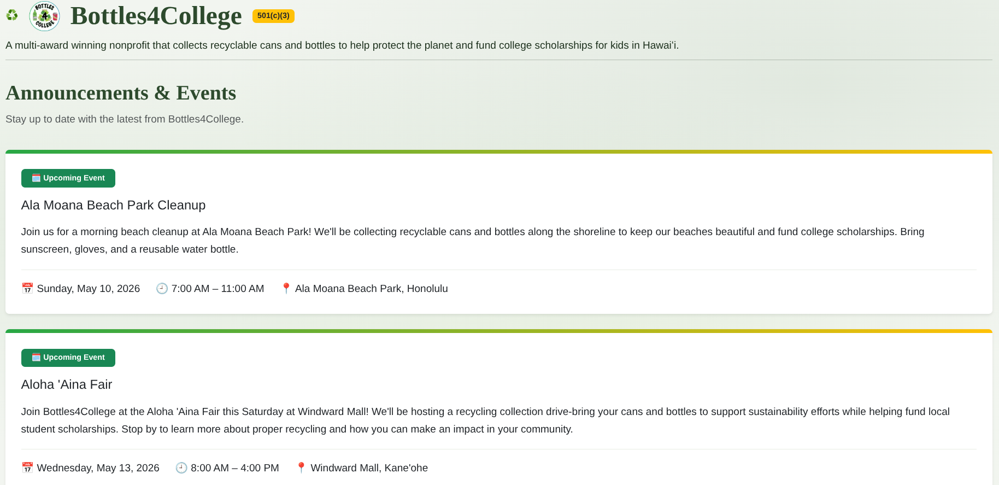

  

My ICS 314 class at UHM culminated in a final project where students made groups of up to 5 where students would collaborate to use everything they've learned to code a website that helps the UHM community in some form. My team decided to create Cycle5ense, a website with an interactable map that allows for easily finding bins in each building within the main campus of UHM. Additionally, this website features announcements from the Bottles4College group, these announcements are held within a database and displayed in pages with the 4 soonest announcements on each page. To fulfill the requirements for the final project, my team created a user system with each user able to self report how much they've recycled. This stat is displayed on their user page as well as added to a total sum of all user rcycle stats. This encourages users to work towards a goal together.

  

  
Personally, I focused mostly on the Bottles4College announcement page. At first, it started off as a mock up page, with the only annonucement being written by hand. Overtime, I created a announcment model that held the event name, date, start time, end time, location, and general description. While all the announcements on the website are currently realistic examples, I implemented pagination to the page so that loading times do not suffer from an immense number of announcement objects. Pagination allows for only the 4 soonest occuring announcements to be displayed at a time, with controls at the bottom of the page to go next, back and to any specific number page.

Overall, I enjoyed working with 4 other classmates and it helped me develop skills that I wouldn't have been able to cultivate otherwise. Working as a team allowed me to understand how it is to work with people as well as working on a specific part individually without stepping on other's toes through the use of branching off of main within the github repo. My social skills in the software engineering context have improved as well. We all worked on our own parts, but we also talked about the code to do so with each other. In total, this final project taught me important skills in both coding and cooperation.

Here are some important links from our final project 
[Github organization](https://github.com/cycle5ense), 
[Github repo](https://github.com/cycle5ense/cycle5ense), 
[Github.io](https://cycle5ense.github.io/), and 
[vercel page](https://cycle5ense.vercel.app/).
