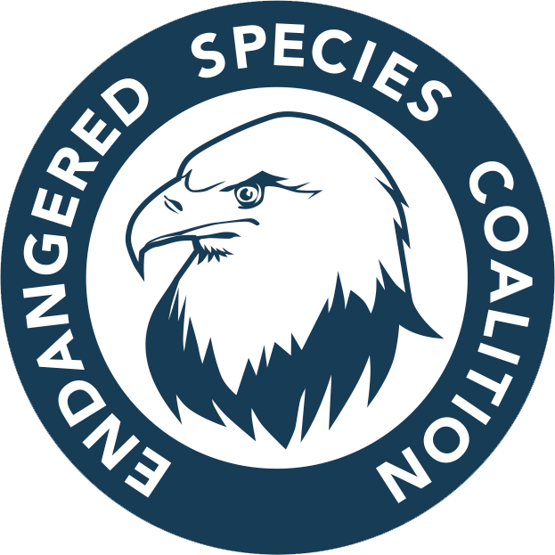

  
  
  

National History Day is a non-profit organization that hosts annual research competitions aimed at students between 6-12th grade. Each year has a different theme that students have to pick historical topics based on. The theme for the 2023 National History Day competition was "frontiers," meaning that students had to pick a topic involved with breaking boundaries into new "frontiers." I submitted a 10 minute documentary on how the Endangered Species Act was the first in a new frontier of laws aimed to preserve the environment. To publish this video, I wrote and read the script, editted and creditted video clips, and submitted the annotated citations.
