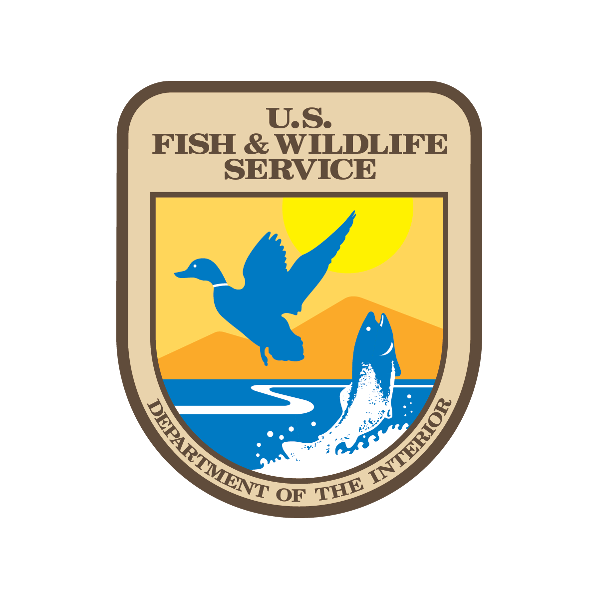

  
  
  

National History Day is a non-profit organization that hosts annual research competitions aimed at students between 6-12th grade. Each year has a different theme that students have to pick historical topics based on. The theme for the 2023 National History Day competition was "frontiers," meaning that students had to pick a topic involved with breaking boundaries into new "frontiers." I submitted a 10 minute documentary on how the Endangered Species Act was the first in a new frontier of laws aimed to preserve the environment. To publish this video, I wrote and read the script, editted and creditted video clips, and submitted the annotated citations.

Having to do so much work for a single project taught me how to teach myself skills quickly, as I had zero video editing skills prior. Furthermore, working on a video project developed my attention to detail as I cut and clipped many different videos as a background for my documentary. Additionally, I improved my communication skills as throughout the district event, I spoke with many judges and got interviewed on my topic and why I chose it.
By talking with various judges and other students, I improved my ability to communicate my project ideas and the reasons behind the decisions I make.
